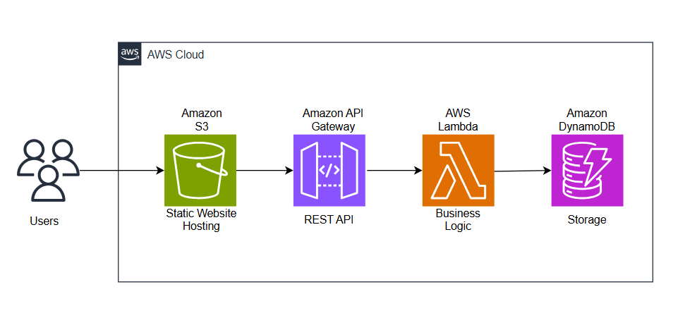

# 🔗 Shortify — Serverless URL Shortener

Shortify is a fully serverless URL shortener built and deployed on AWS.  
It allows users to convert long URLs into short, shareable links using a cloud-native architecture.

---

## 🌐 Live Demo

**Frontend (S3):**  
http://shortify-shreyas-2026.s3-website-us-east-1.amazonaws.com/  

**API Endpoint:**  
https://4mi6u0plhe.execute-api.us-east-1.amazonaws.com/prod/  

---

## 🏗️ Architecture

<p align="center">
  
</p>

```
S3 (Static Website Hosting)
        ↓
API Gateway (REST API)
        ↓
AWS Lambda (Business Logic)
        ↓
DynamoDB (Storage)
```

This project is fully serverless — no EC2, no traditional backend servers.

---

## 🛠️ Technologies Used

- AWS Lambda  
- Amazon API Gateway  
- Amazon DynamoDB  
- Amazon S3 (Static Website Hosting)  
- AWS SDK v3 (JavaScript)  
- HTML, CSS, JavaScript (Frontend)  
- Node.js 20.x Runtime  

---

## 📌 Features

- Generate unique short URLs  
- Redirect to original long URL  
- Fully serverless backend  
- CORS-enabled API  
- Static frontend hosted on S3  
- No server management required  

---

## 📂 Project Structure

```
shortify/
│
├── lambda/
│   ├── createShortUrl.js
│   ├── redirectUrl.js
│   └── package.json
│
├── frontend/
│   ├── index.html
│   ├── style.css
│   └── script.js
│
└── README.md
```

---

## 🚀 Deployment Steps (High Level)

1. Create a DynamoDB table  
2. Create Lambda functions  
3. Connect Lambda to API Gateway  
4. Enable CORS  
5. Upload frontend to S3  
6. Enable static website hosting  

---

## 📖 How It Works

1. User enters a long URL.  
2. Frontend sends a request to API Gateway.  
3. Lambda generates a short ID.  
4. URL + ID stored in DynamoDB.  
5. When short URL is accessed, Lambda fetches original URL and redirects.

